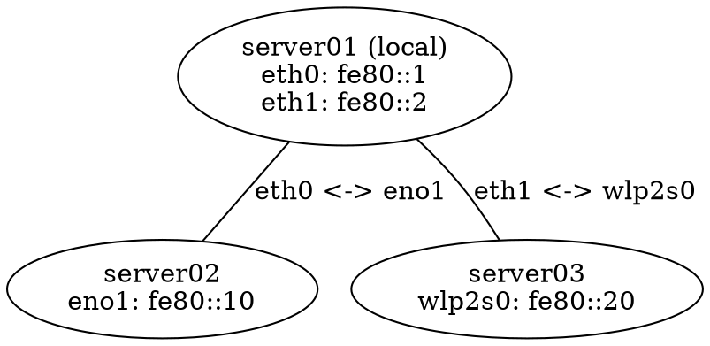
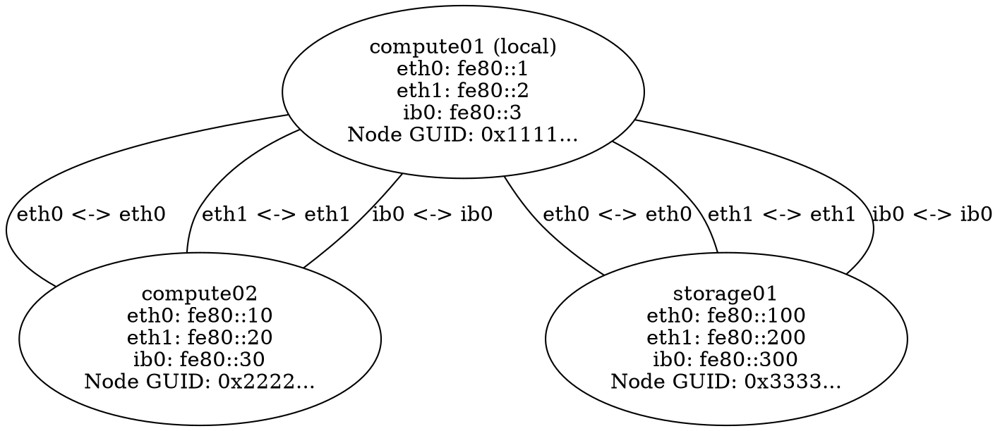

# Graph Edges and InfiniBand Support

## Overview

The daemon now creates **edges** between nodes showing which interfaces are connected, and automatically detects **InfiniBand** interfaces with their unique GUIDs.

## Graph Edges

### What Are Edges?

Edges are connections between nodes in the graph that show:
- Which local interface received packets from which remote interface
- The bidirectional nature of connectivity

### Edge Format

In DOT output, edges appear as:
```dot
"node1_id" -- "node2_id" [label="eth0 <-> eno1"];
```

This means:
- Local node's `eth0` interface sees remote node's `eno1` interface
- They are on the same network segment/VLAN

### Example



**Interpretation:**
- server01's eth0 and server02's eno1 are on the same VLAN
- server01's eth1 and server03's wlp2s0 are on the same VLAN
- server02 and server03 are NOT connected (no edge between them)

## RDMA/InfiniBand Support

### Detection

The daemon uses the **netlink** library (github.com/vishvananda/netlink) to:
1. Discover all network interfaces
2. Detect RDMA devices and their parent network interfaces
3. Map network interfaces to their RDMA devices

RDMA detection works by:
1. Listing all RDMA devices in `/sys/class/infiniband/`
2. Finding parent network interfaces in `/sys/class/infiniband/<device>/device/net/`
3. Reading GUIDs from the RDMA device sysfs files

This approach is more robust than checking interface types, as it:
- Works with all RDMA protocols (InfiniBand, RoCE, iWARP)
- Correctly identifies parent network interfaces
- Handles multiple RDMA devices per interface

### GUIDs

For each RDMA interface, the daemon reads:

1. **RDMA Device Name**: The InfiniBand/RDMA device name (e.g., `mlx5_0`, `mlx4_0`)
2. **node_guid**: Unique identifier for the RDMA HCA port
   - Read from: `/sys/class/infiniband/<device>/node_guid`
   - Format: `0x1234:5678:90ab:cdef`
3. **sys_image_guid**: System image GUID for the HCA
   - Read from: `/sys/class/infiniband/<device>/sys_image_guid`
   - Format: `0xabcd:ef01:2345:6789`

### Display

InfiniBand information is shown in:

**DOT Output:**
```dot
"a1b2c3d4" [label="ib-server\na1b2c3d4\nib0: fe80::1 [mlx5_0]\nNode GUID: 0x1234:5678:90ab:cdef\nSys GUID: 0xabcd:ef01:2345:6789"];
```

**JSON API:**
```json
{
  "a1b2c3d4...": {
    "Hostname": "ib-server",
    "Interfaces": {
      "ib0": {
        "IPAddress": "fe80::1%ib0",
        "RDMADevice": "mlx5_0",
        "NodeGUID": "0x1234:5678:90ab:cdef",
        "SysImageGUID": "0xabcd:ef01:2345:6789"
      }
    }
  }
}
        "IPAddress": "fe80::1%ib0",
        "NodeGUID": "0x1234:5678:90ab:cdef",
        "SysImageGUID": "0xabcd:ef01:2345:6789"
      }
    }
  }
}
```

### Why GUIDs Matter

InfiniBand GUIDs are:
- **Globally unique**: Like MAC addresses for IB
- **Persistent**: Don't change across reboots
- **Useful for routing**: IB subnet managers use GUIDs for routing
- **Diagnostic**: Help identify physical hardware

## Implementation Details

### Data Structures

**InterfaceDetails** (in graph package):
```go
type InterfaceDetails struct {
    IPAddress    string
    NodeGUID     string
    SysImageGUID string
}
```

**Edge**:
```go
type Edge struct {
    LocalInterface  string
    RemoteInterface string
}
```

### Edge Creation

Edges are created when:
1. A packet is received from a remote node
2. We know which local interface received it (via IPv6 control messages)
3. The packet contains which remote interface sent it

The graph stores edges as:
```go
edges[localMachineID][remoteMachineID] = &Edge{
    LocalInterface:  "eth0",
    RemoteInterface: "eno1",
}
```

### Deduplication

Edges are deduplicated in the DOT export to avoid showing the same connection twice (once from each direction).

## Use Cases

### 1. VLAN Mapping

Quickly see which interfaces are on the same VLAN:
```
server01:eth0 -- server02:eth0  (VLAN A)
server01:eth1 -- server03:eth1  (VLAN B)
```

### 2. InfiniBand Fabric Verification

For HPC clusters with InfiniBand:
```
compute01:ib0 -- storage01:ib0
Node GUID: 0x1234...
```

Verify all nodes have unique GUIDs and are properly connected.

### 3. Troubleshooting Asymmetric Connectivity

If node A sees node B but not vice versa, you'll see:
- An edge from A to B
- No edge from B to A (or it will be missing after timeout)

### 4. Multi-Homed Hosts

See all connection paths between multi-homed hosts:
```
server01:eth0 -- server02:eth0
server01:eth1 -- server02:eth1
server01:ib0 -- server02:ib0
```

## Example: HPC Cluster

For a high-performance computing cluster with:
- Management network (eth0)
- Storage network (eth1)  
- InfiniBand fabric (ib0)

The graph will show:


This clearly shows:
- All three networks are functioning
- All nodes can reach each other on all networks
- InfiniBand GUIDs for hardware tracking

## Testing

### Without InfiniBand

Most systems don't have IB interfaces. The daemon works normally:
- Regular Ethernet/WiFi interfaces work as before
- NodeGUID and SysImageGUID fields are empty strings
- Edges still show Ethernet connectivity

### With InfiniBand

On systems with IB:
```bash
# Check if IB is detected
./lldiscovery -log-level info | grep "local node"

# Verify GUIDs in JSON API
curl -s http://localhost:8080/graph | jq '.[] | .Interfaces | .[] | select(.NodeGUID != "")'

# Check DOT output
curl http://localhost:8080/graph.dot | grep "Node GUID"
```

## Performance

- InfiniBand detection: Reads 2-3 small sysfs files per interface at startup
- Edge tracking: O(1) map operations per received packet
- No performance impact on non-IB systems (detection fails fast)

## Compatibility

- **Linux only**: Relies on sysfs (`/sys/class/net`, `/sys/class/infiniband`)
- **Graceful degradation**: If sysfs files don't exist, GUIDs are empty strings
- **No dependencies**: Uses only standard library for IB detection
