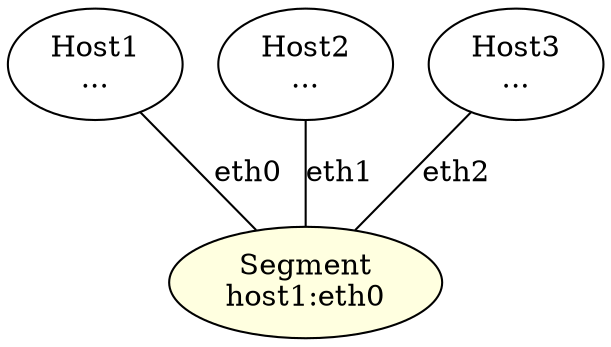

# Network Segment Detection - Design Document

## Problem Statement

When multiple hosts are connected through the same shared network segment (switch/VLAN), the current graph shows N*(N-1)/2 edges between N hosts. This creates visual clutter and doesn't clearly represent the underlying topology where hosts are actually connected through a shared broadcast domain.

## Current Behavior

For 4 hosts on the same switch:
```
Host1 --- Host2
 |    \  /  |
 |     \/   |
 |     /\   |
 |    /  \  |
Host3 --- Host4
```

This shows 6 edges (4*3/2 = 6) when in reality, all 4 hosts are connected to one switch.

## Desired Behavior

```
      Switch/Segment
      (vlan-eth0)
     /  |  |  \
Host1 Host2 Host3 Host4
```

This shows 4 edges (one per host to the segment), which is clearer and more accurate.

## Detection Algorithm

### Phase 1: Identify Shared Segments

For each node in the graph:
1. Group edges by the local interface
2. If multiple direct edges share the same local interface, they represent a shared segment
3. Create a "network segment" identifier: `{machineID}:{interface}`

### Phase 2: Build Segment Map

```go
type NetworkSegment struct {
	ID            string   // "machineID:interface" e.g., "local-123:eth0"
	Interface     string   // "eth0"
	OwnerNodeID   string   // "local-123"
	ConnectedNodes []string // List of remote node IDs on this segment
	IsShared      bool     // true if >1 node connected
}
```

### Phase 3: Detect Islands

An "island" is a set of nodes that are all mutually reachable on the same network segment:
- If Node A sees nodes [B, C, D] on interface eth0
- AND Node B sees nodes [A, C, D] on its interface eth1
- AND Node C sees nodes [A, B, D] on its interface eth2
- AND Node D sees nodes [A, B, C] on its interface eth3
- Then nodes [A, B, C, D] form an island (shared broadcast domain)

Algorithm:
1. For each segment with >1 connected node
2. Check if all connected nodes also see each other
3. If yes, this is a complete island (shared segment)
4. Create a virtual "segment node" to represent it

### Phase 4: Visual Representation

In DOT format:


## Implementation Plan

### 1. Add Segment Detection to Graph Package

**File**: `internal/graph/graph.go`

Add methods:
```go
// GetNetworkSegments identifies shared network segments
func (g *Graph) GetNetworkSegments() []NetworkSegment

// IsSharedSegment checks if multiple nodes are on same segment
func (g *Graph) IsSharedSegment(localNodeID, interface string) bool
```

### 2. Modify DOT Export

**File**: `internal/export/dot.go`

Add configuration:
```go
type DOTOptions struct {
	ShowSegments bool // If true, detect and show network segments
}

func GenerateDOTWithOptions(nodes, edges, options) string
```

### 3. Add Configuration Option

**File**: `internal/config/config.go`

Add field:
```go
type Config struct {
	// ...
	ShowSegments bool `json:"show_segments"`
}
```

Default: `false` (preserve current behavior)

### 4. Update Graph Building

Currently, edges are stored as:
```
edges[localMachineID][remoteMachineID] = []*Edge
```

Need to track which interfaces connect to which neighbors:
```go
// Helper to get all neighbors on a specific local interface
func (g *Graph) GetNeighborsOnInterface(nodeID, iface string) []string
```

## Algorithm Pseudocode

```go
func DetectNetworkSegments(graph *Graph) []NetworkSegment {
	segments := []NetworkSegment{}
	
	// For each node
	for nodeID, node := range graph.GetNodes() {
		// For each interface on this node
		for iface := range node.Interfaces {
			// Get all neighbors on this interface
			neighbors := graph.GetNeighborsOnInterface(nodeID, iface)
			
			// If multiple neighbors on same interface = shared segment
			if len(neighbors) > 1 {
				segment := NetworkSegment{
					ID:             fmt.Sprintf("%s:%s", nodeID, iface),
					Interface:      iface,
					OwnerNodeID:    nodeID,
					ConnectedNodes: neighbors,
					IsShared:       true,
				}
				
				// Check if this is a complete island (all neighbors see each other)
				segment.IsIsland = checkIfIsland(graph, nodeID, iface, neighbors)
				
				segments = append(segments, segment)
			}
		}
	}
	
	return segments
}

func checkIfIsland(graph *Graph, ownerID, ownerIface string, neighbors []string) bool {
	// For it to be an island, each neighbor must see all other neighbors
	for _, neighbor := range neighbors {
		// Get what this neighbor sees
		neighborEdges := graph.GetEdgesFrom(neighbor)
		
		// Check if it sees all other neighbors
		for _, otherNeighbor := range neighbors {
			if neighbor == otherNeighbor {
				continue
			}
			
			if !hasEdgeTo(neighborEdges, otherNeighbor) {
				return false // Not a complete island
			}
		}
	}
	
	return true
}
```

## Edge Cases

1. **Partial Islands**: Some nodes see each other but not all
   - Solution: Only create segment node if >50% are mutually connected
   
2. **Multiple Segments**: Node has multiple interfaces, each with shared segments
   - Solution: Create separate segment node for each interface
   
3. **Single Connection**: Interface has only 1 neighbor
   - Solution: Use regular edge (not a segment)
   
4. **Indirect Edges**: Include or exclude from segment detection?
   - Solution: Only consider direct edges for segment detection

5. **Large Segments**: What if 100 nodes on same segment?
   - Solution: Set a threshold (e.g., if >10 nodes, create segment node)

## Configuration

Expose via config and CLI:
```json
{
  "show_segments": false,
  "segment_threshold": 3
}
```

CLI flag:
```bash
lldiscovery -show-segments -segment-threshold 3
```

## Testing

Test cases:
1. 3 hosts on same switch → create segment node
2. 2 hosts direct connection → regular edge
3. 5 hosts, 4 on switch + 1 separate → segment for 4, regular edge for 1
4. Partial connectivity → handle gracefully
5. Multiple interfaces per host → create segment per interface

## Visualization Examples

### Before (3 hosts on switch):
```
Host1 --- Host2
  |     /
  |   /
Host3
```
(3 edges)

### After (3 hosts on switch):
```
    Segment
    /  |  \
Host1 Host2 Host3
```
(3 edges, but clearer structure)

### Complex Example (2 switches, 6 hosts):
```
Switch-A           Switch-B
/  |  \            /  |  \
H1 H2 H3          H4 H5 H6
     |______________|
     (inter-switch link)
```

## Benefits

1. **Clearer Topology**: Shows actual network structure
2. **Less Clutter**: Reduces edge count for large segments
3. **Better Understanding**: Makes VLAN/switch boundaries visible
4. **Scalability**: Handles large networks better

## Drawbacks

1. **Detection Overhead**: Additional computation
2. **False Positives**: Might incorrectly group nodes
3. **Complexity**: More complex graph logic

## Alternatives Considered

1. **Subgraphs/Clusters**: Use DOT subgraph feature
   - Pro: Native DOT support
   - Con: Doesn't reduce edge count
   
2. **Color Coding**: Color edges by segment
   - Pro: Simple implementation
   - Con: Doesn't reduce clutter
   
3. **Hierarchical Layout**: Multiple levels
   - Pro: Natural representation
   - Con: Complex to implement

## Decision

Implement segment node approach with:
- **Default**: Disabled (preserve current behavior)
- **Threshold**: 3+ nodes triggers segment node
- **Visualization**: Virtual ellipse nodes colored differently
- **Labels**: Show segment identifier and interface

## Timeline

1. Phase 1: Add detection algorithm (graph package)
2. Phase 2: Update DOT export (export package)
3. Phase 3: Add configuration options
4. Phase 4: Testing and documentation
5. Phase 5: Update examples and README
