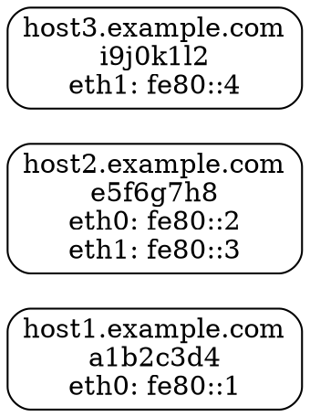

# Quick Start Guide

## Running the daemon

### Option 1: Quick test (foreground)
```bash
# Build
make build

# Run with defaults (outputs to ./topology.dot)
./lldiscovery

# Run with debug logging
./lldiscovery -log-level debug

# Run with custom settings via flags
./lldiscovery -send-interval 10s -http-address :9999

# Enable transitive discovery
./lldiscovery -include-neighbors

# Or with custom config file
./lldiscovery -config config.example.json

# Combine config file with flag overrides (flags take precedence)
./lldiscovery -config config.json -log-level debug -send-interval 15s
```

**Available Flags:**
- `-send-interval` - How often to send packets (e.g., 10s, 30s, 1m)
- `-node-timeout` - Node expiration timeout (e.g., 60s, 2m)
- `-http-address` - HTTP API address (e.g., :6469, :9999)
- `-output-file` - DOT file path (e.g., /tmp/topology.dot)
- `-include-neighbors` - Enable transitive discovery
- `-log-level` - Logging level (debug, info, warn, error)
- See all flags with `./lldiscovery --help`

**Note:** When running as a regular user, the daemon saves the graph to `./topology.dot` in the current directory. When running as root or with a systemd service, it uses `/var/lib/lldiscovery/topology.dot`.

### Option 2: Production deployment

```bash
# Build
make build

# Install binary
sudo make install

# Create user and directories
sudo useradd -r -s /bin/false lldiscovery
sudo mkdir -p /var/lib/lldiscovery /etc/lldiscovery
sudo chown lldiscovery:lldiscovery /var/lib/lldiscovery

# Copy config
sudo cp config.example.json /etc/lldiscovery/config.json
sudo chown root:lldiscovery /etc/lldiscovery/config.json
sudo chmod 640 /etc/lldiscovery/config.json

# Install systemd service
sudo cp lldiscovery.service /etc/systemd/system/
sudo systemctl daemon-reload
sudo systemctl enable lldiscovery
sudo systemctl start lldiscovery

# Check status
sudo systemctl status lldiscovery
sudo journalctl -u lldiscovery -f
```

## Using the HTTP API

```bash
# Health check
curl http://localhost:6469/health

# View current topology (JSON)
curl http://localhost:6469/graph | jq

# Get DOT format
curl http://localhost:6469/graph.dot
```

## Visualization

```bash
# Install graphviz
sudo apt-get install graphviz  # Debian/Ubuntu
sudo yum install graphviz      # RHEL/CentOS
brew install graphviz          # macOS

# Generate topology image from HTTP API
curl http://localhost:6469/graph.dot | dot -Tpng -o topology.png

# Or from file (check daemon logs for actual path)
# If running as user: ./topology.dot
# If running as root: /var/lib/lldiscovery/topology.dot
dot -Tpng ./topology.dot -o topology.png

# SVG format (better for web viewing)
curl http://localhost:6469/graph.dot | dot -Tsvg -o topology.svg

# Interactive graph (xdot)
curl http://localhost:6469/graph.dot | xdot -

# Auto-refresh visualization
watch -n 5 'curl -s http://localhost:6469/graph.dot | dot -Tpng -o topology.png'
```

## Testing Multi-Host Setup

To test discovery between multiple hosts:

1. **Setup on each host:**
   ```bash
   # Install and start daemon on each host
   ./lldiscovery -log-level info
   ```

2. **Verify multicast connectivity:**
   ```bash
   # On host1, ping all-nodes multicast
   ping6 ff02::1%eth0
   
   # Should see responses from other hosts on same VLAN
   ```

3. **Check discovery:**
   ```bash
   # On any host, check discovered nodes
   curl http://localhost:6469/graph
   
   # Generate topology
   curl http://localhost:6469/graph.dot | dot -Tpng -o topology.png
   ```

## Example Topology Output

After running on multiple hosts in a VLAN-segmented network:



This shows:
- host1 and host2 can see each other on eth0 (same VLAN)
- host2 and host3 can see each other on eth1 (different VLAN)
- host1 and host3 cannot see each other (isolated VLANs)

## Troubleshooting

### No other hosts discovered

1. **Check IPv6:**
   ```bash
   ip -6 addr show
   # Should see fe80::... addresses
   ```

2. **Check firewall:**
   ```bash
   # Allow UDP 9999
   sudo ip6tables -A INPUT -p udp --dport 9999 -j ACCEPT
   ```

3. **Test multicast:**
   ```bash
   # Should work across VLAN
   ping6 ff02::1%eth0
   ```

4. **Check logs:**
   ```bash
   ./lldiscovery -log-level debug
   ```

### Permission errors

```bash
# Need network capabilities for multicast
sudo setcap cap_net_raw,cap_net_admin=+ep ./lldiscovery
./lldiscovery

# Or run with sudo (testing only)
sudo ./lldiscovery
```

## Configuration Examples

### Fast discovery (10s intervals)
```json
{
  "send_interval": "10s",
  "node_timeout": "30s",
  "export_interval": "15s"
}
```

### Slow/reliable (2min intervals)
```json
{
  "send_interval": "120s",
  "node_timeout": "600s",
  "export_interval": "180s"
}
```

### Custom port (avoid conflicts)
```json
{
  "multicast_port": 19999,
  "http_address": ":9090"
}
```
