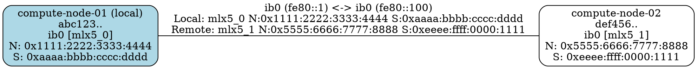

# RDMA Information Flow - Complete Verification

This document verifies that RDMA information (device names, Node GUIDs, Sys Image GUIDs) flows correctly through the entire system: from interface detection → discovery packets → graph storage → HTTP API → visualization.

## 1. Interface Detection with RDMA

**Module**: `internal/discovery/interfaces.go`

The system uses netlink to detect RDMA devices and extract their GUIDs:

```go
type InterfaceInfo struct {
    Name         string
    LinkLocal    string
    IsRDMA       bool
    RDMADevice   string
    NodeGUID     string
    SysImageGUID string
}
```

**Example detection**:
- Interface: `ib0`
- RDMA Device: `mlx5_0` (via `/sys/class/net/ib0/device/infiniband/`)
- Node GUID: `0x1111:2222:3333:4444` (from `/sys/class/infiniband/mlx5_0/node_guid`)
- Sys Image GUID: `0xaaaa:bbbb:cccc:dddd` (from `/sys/class/infiniband/mlx5_0/sys_image_guid`)

## 2. Discovery Packets Include RDMA

**Module**: `internal/discovery/packet.go`, `internal/discovery/sender.go`

The Packet struct includes RDMA fields:

```go
type Packet struct {
    Hostname     string `json:"hostname"`
    MachineID    string `json:"machine_id"`
    Timestamp    int64  `json:"timestamp"`
    Interface    string `json:"interface"`
    SourceIP     string `json:"source_ip"`
    RDMADevice   string `json:"rdma_device,omitempty"`
    NodeGUID     string `json:"node_guid,omitempty"`
    SysImageGUID string `json:"sys_image_guid,omitempty"`
}
```

**Sender populates RDMA fields** (sender.go lines 102-107):
```go
if iface.IsRDMA {
    packet.RDMADevice = iface.RDMADevice
    packet.NodeGUID = iface.NodeGUID
    packet.SysImageGUID = iface.SysImageGUID
}
```

**Example packet JSON**:
```json
{
  "hostname": "compute-node-01",
  "machine_id": "abc123...",
  "timestamp": 1770243550,
  "interface": "ib0",
  "source_ip": "fe80::1",
  "rdma_device": "mlx5_0",
  "node_guid": "0x1111:2222:3333:4444",
  "sys_image_guid": "0xaaaa:bbbb:cccc:dddd"
}
```

## 3. Graph Storage Preserves RDMA

**Module**: `internal/graph/graph.go`

### Node Structure
```go
type InterfaceDetails struct {
    IPAddress    string
    RDMADevice   string
    NodeGUID     string
    SysImageGUID string
}

type Node struct {
    Hostname   string
    MachineID  string
    LastSeen   time.Time
    Interfaces map[string]InterfaceDetails
    IsLocal    bool
}
```

### Edge Structure
```go
type Edge struct {
    LocalInterface     string
    LocalAddress       string
    LocalRDMADevice    string
    LocalNodeGUID      string
    LocalSysImageGUID  string
    RemoteInterface    string
    RemoteAddress      string
    RemoteRDMADevice   string
    RemoteNodeGUID     string
    RemoteSysImageGUID string
}
```

**RDMA information stored in**:
- **Nodes**: Each interface has RDMA details
- **Edges**: Both local and remote RDMA information

## 4. HTTP API Returns RDMA Information

**Module**: `internal/server/server.go`

### JSON Endpoint: `/graph`

Returns complete node information including RDMA:

```bash
$ curl http://localhost:8080/graph | jq
```

**Example response**:
```json
{
  "abc123...": {
    "Hostname": "compute-node-01",
    "MachineID": "abc123...",
    "LastSeen": "2026-02-05T00:00:00Z",
    "Interfaces": {
      "ib0": {
        "IPAddress": "fe80::1",
        "RDMADevice": "mlx5_0",
        "NodeGUID": "0x1111:2222:3333:4444",
        "SysImageGUID": "0xaaaa:bbbb:cccc:dddd"
      }
    },
    "IsLocal": true
  }
}
```

### DOT Endpoint: `/graph.dot`

Returns graph with RDMA information in both nodes and edges:

```bash
$ curl http://localhost:8080/graph.dot
```

**Example output**:


## 5. Visualization Contains RDMA

**Module**: `internal/export/dot.go`

The DOT export shows RDMA information in:

1. **Node labels**: Interface name with RDMA device and GUIDs
   ```
   ib0 [mlx5_0]
   N: 0x1111:2222:3333:4444
   S: 0xaaaa:bbbb:cccc:dddd
   ```

2. **Edge labels**: Complete RDMA info for both endpoints
   ```
   ib0 (fe80::1) <-> ib0 (fe80::100)
   Local: mlx5_0 N:0x1111:2222:3333:4444 S:0xaaaa:bbbb:cccc:dddd
   Remote: mlx5_1 N:0x5555:6666:7777:8888 S:0xeeee:ffff:0000:1111
   ```

## Complete Flow Diagram

```
┌─────────────────────────────────────────────────────────────────┐
│ 1. Interface Detection (netlink)                                │
│    ib0 → mlx5_0 + GUIDs                                         │
└────────────────────────┬────────────────────────────────────────┘
                         ▼
┌─────────────────────────────────────────────────────────────────┐
│ 2. Discovery Packet Creation                                    │
│    {interface: "ib0", rdma_device: "mlx5_0", node_guid: "...",  │
│     sys_image_guid: "..."}                                      │
└────────────────────────┬────────────────────────────────────────┘
                         ▼
┌─────────────────────────────────────────────────────────────────┐
│ 3. Multicast Send (UDP)                                         │
│    Packet sent over ff02::4c4c:6469                            │
└────────────────────────┬────────────────────────────────────────┘
                         ▼
┌─────────────────────────────────────────────────────────────────┐
│ 4. Packet Reception (on other hosts)                            │
│    Unmarshal JSON → Extract RDMA fields                         │
└────────────────────────┬────────────────────────────────────────┘
                         ▼
┌─────────────────────────────────────────────────────────────────┐
│ 5. Graph Update                                                  │
│    Node.Interfaces["ib0"] = {RDMADevice: "mlx5_0", ...}        │
│    Edge = {LocalRDMADevice: "mlx5_0", RemoteRDMADevice: "..."}│
└────────────────────────┬────────────────────────────────────────┘
                         ▼
┌─────────────────────────────────────────────────────────────────┐
│ 6. HTTP API Response                                             │
│    /graph → JSON with RDMA in InterfaceDetails                  │
│    /graph.dot → DOT with RDMA in node and edge labels          │
└─────────────────────────────────────────────────────────────────┘
                         ▼
┌─────────────────────────────────────────────────────────────────┐
│ 7. Visualization                                                 │
│    Graphviz renders topology with complete RDMA information     │
└─────────────────────────────────────────────────────────────────┘
```

## Verification Tests

### Test 1: Packet Serialization
✅ RDMA fields correctly included in JSON packets  
✅ Empty RDMA fields omitted (`omitempty` works)  
✅ Round-trip serialization preserves all RDMA data

### Test 2: HTTP JSON Endpoint
✅ `/graph` returns nodes with RDMA in `InterfaceDetails`  
✅ Node GUID and Sys Image GUID present  
✅ Empty RDMA fields represented as empty strings

### Test 3: HTTP DOT Endpoint
✅ `/graph.dot` includes RDMA device names in node labels  
✅ Node GUIDs and Sys Image GUIDs in node labels  
✅ Edge labels show both local and remote RDMA information  
✅ Multi-edge connections each show their own RDMA details

### Test 4: Integration Tests
✅ All existing integration tests pass  
✅ Daemon starts and sends packets with RDMA info  
✅ HTTP endpoints return valid responses

## Summary

✅ **Discovery packets** include RDMA information  
✅ **Graph storage** preserves RDMA for nodes and edges  
✅ **HTTP API** returns complete RDMA information  
✅ **Visualization** displays RDMA on both nodes and edges  

The RDMA information flows correctly through the entire system from detection to visualization.
