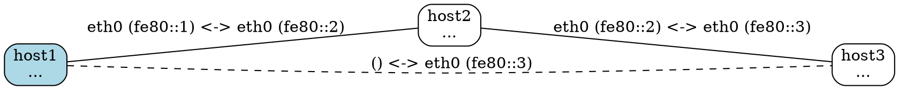

# Transitive Topology Discovery

The lldiscovery daemon supports **transitive topology discovery**, allowing each host to see the complete network topology including hosts they are not directly connected to.

## Overview

By default, each daemon only knows about its directly connected neighbors (hosts it receives discovery packets from). With transitive discovery enabled, each daemon shares information about its direct neighbors in its discovery packets, allowing other daemons to build a complete topology graph.

## Configuration

Transitive discovery is **disabled by default** for backward compatibility. To enable it:

```json
{
  "include_neighbors": true
}
```

## How It Works

### Without Transitive Discovery (Default)

```
Physical topology:
A ---- B ---- C

What each node knows:
- Node A: knows about B
- Node B: knows about A and C
- Node C: knows about B

Result: A doesn't know C exists, C doesn't know A exists
```

### With Transitive Discovery Enabled

```
Physical topology:
A ---- B ---- C

Packet flow:
1. B sends packet to A including neighbor list: [C]
2. A creates direct edge to B (solid line)
3. A creates indirect edge to C (dashed line, learned from B)

What each node knows:
- Node A: knows about B (direct) and C (indirect via B)
- Node B: knows about A (direct) and C (direct)
- Node C: knows about B (direct) and A (indirect via B)

Result: Complete topology visible to all nodes!
```

## Packet Structure

When `include_neighbors: true`, discovery packets include a neighbors array:

```json
{
  "hostname": "host1.example.com",
  "machine_id": "a1b2c3d4e5f6789...",
  "timestamp": 1234567890,
  "interface": "ib0",
  "source_ip": "fe80::1",
  "rdma_device": "mlx5_0",
  "node_guid": "0x1111:2222:3333:4444",
  "sys_image_guid": "0xaaaa:bbbb:cccc:dddd",
  "neighbors": [
    {
      "machine_id": "x9y8z7w6v5u4321...",
      "hostname": "host2.example.com",
      "interface": "ib0",
      "address": "fe80::2",
      "is_rdma": true,
      "rdma_device": "mlx5_1",
      "node_guid": "0x5555:6666:7777:8888",
      "sys_image_guid": "0xeeee:ffff:0000:1111"
    }
  ]
}
```

### Packet Size Considerations

- **Base packet**: ~173 bytes (no RDMA) or ~267 bytes (with RDMA)
- **Each neighbor**: ~150-250 bytes depending on RDMA info
- **Example**: 10 neighbors ≈ 1.5-2.5 KB additional data
- **UDP multicast limit**: 64 KB (sufficient for typical deployments)

## Visualization

### Direct vs Indirect Edges

**Direct edges** (solid lines):
- Local host received packet directly from remote host
- Both endpoints verified

**Indirect edges** (dashed lines):
- Learned from another host's neighbor list
- Only remote endpoint verified
- Local interface info may be absent

### Example DOT Output



### RDMA with Indirect Edges

RDMA-to-RDMA indirect connections are shown with:
- **Dashed blue lines** (`color="blue", penwidth=2.0, style="dashed"`)
- RDMA information in label

```dot
"host1" -- "host3" [
  label=" () <-> ib0 (fe80::3)\nRemote: mlx5_1 N:0x5555... S:0xeeee...",
  style="dashed"
];
```

## Cascading Expiration

When a node expires (no packets received within `node_timeout`), all information learned through that node is also removed:

```
Scenario:
- A has direct edge to B
- A has indirect edge to C (learned from B)
- B stops sending packets and expires

Result:
- A removes B (direct edge)
- A automatically removes C (indirect edge learned from B)
```

This prevents stale indirect information from persisting in the graph.

### Implementation

```go
// When node X expires:
1. Remove node X from nodes map
2. Remove all edges to/from X
3. Scan all edges and remove where LearnedFrom == X.MachineID
```

## Edge Upgrades

If an indirect edge exists and a direct packet arrives, the edge is automatically upgraded:

```
Initial state:
- A -> C indirect (dashed line, learned from B)

Direct connection established:
- C starts sending packets to A
- A receives direct packet from C
- Edge upgraded to direct (solid line)
- LearnedFrom cleared
```

## Topology Depth Limit

To prevent packet size explosion, each daemon only shares its **direct neighbors** (1-hop):

```
A ---- B ---- C ---- D

B shares with A: [C] (B's direct neighbor)
B does NOT share: [D] (C's neighbor, 2 hops from B)

This prevents exponential growth while still providing
significant topology visibility.
```

## Use Cases

### 1. Monitoring Hosts

Deploy a monitoring host connected to only one network node. With transitive discovery enabled, it sees the entire topology without needing connections to all hosts.

```
[Monitor] ---- [Gateway] ---- [Compute Cluster]
   ^                               ^
   |                               |
   Sees everything via Gateway     Full mesh
```

### 2. Segmented Networks

In networks with multiple isolated segments connected through gateways, each segment can see the full topology of its own segment plus one hop beyond.

### 3. Debugging Connectivity

Quickly identify network partitions by comparing what each node thinks the topology looks like.

## API Endpoints

### HTTP JSON API

```bash
curl http://localhost:8080/graph
```

Edges include `direct` and `learned_from` fields:

```json
{
  "nodes": {...},
  "edges": {
    "machine-id-A": {
      "machine-id-B": [
        {
          "local_interface": "eth0",
          "remote_interface": "eth0",
          "direct": true
        }
      ],
      "machine-id-C": [
        {
          "local_interface": "",
          "remote_interface": "eth0",
          "direct": false,
          "learned_from": "machine-id-B"
        }
      ]
    }
  }
}
```

### DOT Format

```bash
curl http://localhost:8080/dot
```

Returns Graphviz DOT with:
- Solid lines for direct connections
- Dashed lines for indirect connections
- Blue for RDMA-to-RDMA (solid or dashed)

## Performance Impact

### Network

- **Packet size**: Increases linearly with number of direct neighbors
- **Typical overhead**: 1-2 KB per packet for 10 neighbors
- **Bandwidth**: Negligible (packets sent every 30 seconds by default)

### CPU/Memory

- **Processing**: Minimal - O(N) where N is number of neighbors in packet
- **Memory**: Each indirect edge adds ~200 bytes
- **Typical impact**: <1% CPU, <10 MB additional memory for 100-node clusters

### Convergence Time

- **Direct edges**: Detected within 1 send_interval (30s default)
- **Indirect edges**: Detected within 2 send_intervals (60s default)
- **Expiration**: Within node_timeout (120s default)

## Backward Compatibility

- **Old daemons**: Ignore the `neighbors` field in packets (JSON unmarshaling skips unknown fields)
- **New daemons**: Work fine without `neighbors` field (when feature disabled)
- **Mixed environment**: New daemons see complete topology, old daemons see only direct connections

## Configuration Example

```json
{
  "send_interval": "30s",
  "node_timeout": "120s",
  "export_interval": "60s",
  "multicast_address": "ff02::4c4c:6469",
  "multicast_port": 9999,
  "output_file": "/var/lib/lldiscovery/topology.dot",
  "http_address": ":8080",
  "log_level": "info",
  "include_neighbors": true
}
```

## Troubleshooting

### Indirect edges not appearing

1. Check `include_neighbors` is `true` on the sending host
2. Verify direct edge exists first (indirect edges depend on direct connections)
3. Check logs with `log_level: debug` to see neighbor information in packets

### Stale indirect edges

- Should auto-expire when source node expires
- Check `node_timeout` configuration
- Verify cascading deletion with debug logs

### Packet size too large

- Reduce number of network interfaces (fewer direct connections)
- Consider splitting network into smaller segments
- Monitor packet sizes in debug logs: "size=XXXX"

## Related Documentation

- [GRAPH_EDGES_IB.md](GRAPH_EDGES_IB.md) - Multi-edge support for multi-homed hosts
- [RDMA_EDGE_VISUAL.md](RDMA_EDGE_VISUAL.md) - Visual styling for RDMA connections
- [LOCAL_NODE_FEATURE.md](LOCAL_NODE_FEATURE.md) - Local node highlighting
- [DEBUG_LOGGING.md](DEBUG_LOGGING.md) - Debug logging with packet content
