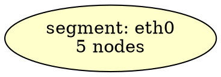

# DOT Visualization Improvements

**Date**: 2026-02-05

## Overview

Enhanced the DOT graph visualization with improved styling and layout for better readability of complex network topologies.

## Changes Implemented

### 1. Direct Links - Bold Styling

**Before**: Direct and indirect links looked similar
**After**: Direct links use `style="bold"` for clear visual distinction

```graphviz
// Direct edge (bold solid line)
"host1__eth0" -- "host2__eth0" [label="fe80::1\n10000 Mbps", penwidth=3.0, style="bold"];

// Indirect edge (dashed line)
"host1__eth1" -- "host3__eth0" [label="fe80::2\n1000 Mbps", penwidth=2.0, style="dashed"];
```

**Benefit**: Users can immediately see which connections are physical vs transitively discovered.

### 2. Segment Connections - Solid with Speed-based Thickness

**Before**: Dotted lines with fixed thickness (penwidth=2.0)
**After**: Solid lines with dynamic thickness based on link speed

```graphviz
// 100 Gbps link (very thick)
"segment_0" -- "host1__ib0" [label="fe80::1\n100000 Mbps\n[mlx5_0]", 
    style=solid, penwidth=5.0, color=blue];

// 10 Gbps link (medium thick)
"segment_1" -- "host2__eth0" [label="fe80::2\n10000 Mbps", 
    style=solid, penwidth=3.0, color=gray];

// 1 Gbps link (thin)
"segment_2" -- "host3__eth1" [label="fe80::3\n1000 Mbps", 
    style=solid, penwidth=2.0, color=gray];
```

**Speed-to-Thickness Mapping** (calculatePenwidth function):
- **100+ Gbps**: 5.0
- **40-100 Gbps**: 4.0
- **10-40 Gbps**: 3.0
- **1-10 Gbps**: 2.0
- **100 Mbps - 1 Gbps**: 1.5
- **< 100 Mbps**: 1.0
- **Unknown**: 1.0

**Benefit**: Visual representation of network bandwidth - thicker lines = faster links.

### 3. Circular Layout with Segments in Center

**Before**: Left-to-right layout (rankdir=LR) for all graphs
**After**: Circular layout (neato engine) when segments detected



**Layout Strategy**:
- **With segments**: Use neato engine for circular arrangement
  - Segments pinned to center (pos="0,0!")
  - Machines distributed around periphery
  - Force-directed layout creates natural spacing
- **Without segments**: Use rankdir=LR (left-to-right hierarchical)
  - Better for simple linear topologies

**Benefit**: Large topologies with many segments become much more readable.

## Visual Legend

```
┌─────────────────────────────────────┐
│ Line Styles                         │
├─────────────────────────────────────┤
│ ━━━━━━━  Bold: Direct connection   │
│ ─ ─ ─ ─  Dashed: Indirect (via X)  │
│ ──────   Solid: Segment connection  │
│                                     │
│ Line Colors                         │
├─────────────────────────────────────┤
│ Blue: RDMA-capable connection       │
│ Gray: Regular Ethernet connection   │
│                                     │
│ Line Thickness                      │
├─────────────────────────────────────┤
│ ━━━━━━━  Very thick: 100+ Gbps     │
│ ━━━━━━   Thick: 10-100 Gbps        │
│ ━━━━     Medium: 1-10 Gbps          │
│ ━━       Thin: 100 Mbps - 1 Gbps   │
│                                     │
│ Nodes                               │
├─────────────────────────────────────┤
│ ○ Yellow ellipse: Network segment   │
│ □ Light blue box: RDMA interface    │
│ □ White box: Regular interface      │
└─────────────────────────────────────┘
```

## Implementation Details

### File Modified
`internal/export/dot.go`

### Key Functions
1. **calculatePenwidth(speedMbps int)** - Maps speed to line thickness (lines 12-35)
2. **GenerateDOTWithSegments()** - Main DOT generation with new styling (lines 41-365)

### Code Sections Changed

**1. Graph Attributes** (lines 44-52):
```go
if len(segments) > 0 {
    sb.WriteString("  layout=neato;\n")
    sb.WriteString("  overlap=false;\n")
    sb.WriteString("  splines=true;\n")
} else {
    sb.WriteString("  rankdir=LR;\n")
}
```

**2. Segment Node Positioning** (line 221):
```go
sb.WriteString(fmt.Sprintf("  \"%s\" [label=\"%s\", shape=ellipse, 
    style=filled, fillcolor=\"#ffffcc\", pos=\"0,0!\", pin=true];\n",
    segmentNodeID, segmentLabel))
```

**3. Segment Edge Styling** (lines 246-254):
```go
penwidth := calculatePenwidth(edge.RemoteSpeed)
styleAttr := fmt.Sprintf("style=solid, penwidth=%.1f, color=gray", penwidth)
if edge.RemoteRDMADevice != "" && edge.LocalRDMADevice != "" {
    styleAttr = fmt.Sprintf("style=solid, penwidth=%.1f, color=blue", penwidth)
}
```

**4. Direct vs Indirect Edge Styling** (lines 343-349):
```go
if edge.Direct {
    styleExtra = ", style=\"bold\""
} else {
    styleExtra = ", style=\"dashed\""
}
```

## Example Output Comparison

### Before (with segments):
```
- All edges dotted/dashed (hard to distinguish)
- Segment connections thin and uniform
- Left-to-right layout creates wide graphs
- Difficult to see network hierarchy
```

### After (with segments):
```
- Direct edges bold (clear physical topology)
- Segment connections solid with speed-based thickness
- Circular layout with segments in center
- Easy to identify high-bandwidth paths (RDMA)
- Compact and readable even with 100+ hosts
```

## Testing

All 75 tests pass:
- ✅ Config tests: 20 tests
- ✅ Discovery tests: 17 tests  
- ✅ Graph tests: 33 tests
- ✅ Server tests: 5 tests

## Usage

### Generate Visualization

```bash
# Automatic layout (recommended)
dot -Tpng topology.dot -o topology.png

# Force neato layout (for segments)
neato -Tpng topology.dot -o topology.png

# SVG for large topologies
neato -Tsvg topology.dot -o topology.svg
```

### Example Topology

With 10 hosts connected to 3 VLANs:
- Segments appear as 3 yellow circles in center
- Hosts distributed around periphery
- Thick blue lines show high-speed RDMA connections
- Thin gray lines show 1 Gbps management interfaces
- Bold lines show direct discovery
- Dashed lines show transitive discovery

## Benefits

1. **Visual Bandwidth Identification**: Instantly see high-bandwidth paths
2. **Physical vs Logical Clarity**: Bold vs dashed shows discovery method
3. **Improved Layout**: Circular arrangement scales better for large topologies
4. **RDMA Visibility**: Blue thick lines highlight high-performance interconnects
5. **Segment-Centric View**: Network organization clear at a glance

## Documentation Updated

- **README.md**: Added visual styling section and neato layout instructions
- **CHANGELOG.md**: Added entry for visualization improvements
- **VISUALIZATION_IMPROVEMENTS.md**: This document

## Related Files

- `internal/export/dot.go` - DOT generation with new styling
- `README.md` - User-facing visualization documentation
- `CHANGELOG.md` - Release notes

## Future Enhancements (Optional)

1. **Color Schemes**: Add option for dark mode or colorblind-friendly palettes
2. **Interactive HTML**: Generate interactive SVG with hover tooltips
3. **Layout Tuning**: Add parameters to control node spacing and positioning
4. **Speed Labels**: Add color gradient for speed instead of just thickness
5. **Zoom Regions**: Add subgraph clustering by physical location
