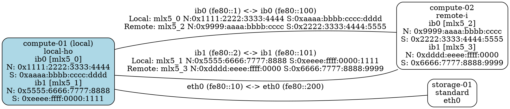

# RDMA Edge Labels - Complete Example

This document shows the complete format of edge labels with RDMA information.

## Edge Label Format

### Standard Ethernet Connection
```
eth0 (fe80::1) <-> eth0 (fe80::10)
```
Simple format showing interface names and IPv6 link-local addresses.

### InfiniBand/RDMA Connection (Full Detail)
```
ib0 (fe80::1) <-> ib0 (fe80::100)
Local: mlx5_0 N:0x1111:2222:3333:4444 S:0xaaaa:bbbb:cccc:dddd
Remote: mlx5_2 N:0x9999:aaaa:bbbb:cccc S:0x2222:3333:4444:5555
```

Where:
- **Interface names and addresses**: `ib0 (fe80::1) <-> ib0 (fe80::100)`
- **Local RDMA device**: `mlx5_0` (Mellanox ConnectX-5 or newer)
- **Local Node GUID**: `N:0x1111:2222:3333:4444` - Unique identifier for the HCA port
- **Local Sys Image GUID**: `S:0xaaaa:bbbb:cccc:dddd` - System-level identifier for the HCA
- **Remote side**: Same format for remote endpoint

### Mixed Connection (One side RDMA)
```
ib0 (fe80::1) <-> eth0 (fe80::200)
Local: mlx5_0 N:0x1111:2222:3333:4444 S:0xaaaa:bbbb:cccc:dddd
```
Only local side has RDMA - remote side is standard Ethernet.

## Complete Graph Example



## Benefits

1. **Complete Hardware Identification**: Both Node GUID and Sys Image GUID visible
2. **Multi-path Visualization**: Each IB port pair shown separately
3. **Troubleshooting**: Easy to identify specific HCA ports
4. **Fabric Management**: Clear view of all RDMA connections
5. **Mixed Environments**: Clearly shows RDMA vs standard Ethernet connections

## Use Cases

### InfiniBand Fabric Mapping
Track all IB connections between compute nodes with complete HCA identification.

### RoCE Network Verification
Verify RDMA over Converged Ethernet deployments with GUID information.

### Multi-rail InfiniBand
Visualize dual-rail or multi-rail IB configurations with separate edges per rail.

### Hardware Inventory
Identify all Mellanox/NVIDIA HCAs in the cluster with their GUIDs.
