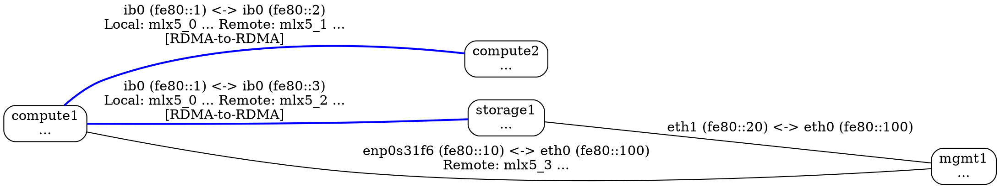

# RDMA Edge Visual Styling

The lldiscovery daemon provides **visual distinction for RDMA-to-RDMA connections** in the generated Graphviz DOT output. This makes it easy to identify high-performance RDMA fabric paths at a glance.

## Edge Types and Styling

### 1. RDMA-to-RDMA Edges (Blue, Thick)

When **both** endpoints have RDMA devices, the edge is marked as a high-performance RDMA connection:

```dot
"host1" -- "host2" [
  label="ib0 (fe80::1) <-> ib0 (fe80::100)\nLocal: mlx5_0 N:0x1111... S:0xaaaa...\nRemote: mlx5_1 N:0x9999... S:0x2222...\n[RDMA-to-RDMA]",
  color="blue",
  penwidth=2.0
];
```

**Visual appearance:**
- **Color:** Blue
- **Line width:** Thick (2.0x normal)
- **Label indicator:** `[RDMA-to-RDMA]` text
- **RDMA info:** Both local and remote device details shown

**Examples:**
- InfiniBand to InfiniBand (mlx5_0 ↔ mlx5_1)
- RoCE to RoCE (mlx5_2 ↔ mlx5_3)
- Soft-RoCE to hardware (rxe0 ↔ mlx5_0)

### 2. Mixed Edges (RDMA on One Side)

When only **one** endpoint has an RDMA device:

```dot
"host1" -- "host2" [
  label="ib0 (fe80::1) <-> eth0 (fe80::200)\nLocal: mlx5_0 N:0x1111... S:0xaaaa..."
];
```

**Visual appearance:**
- **Color:** Black (default)
- **Line width:** Normal
- **Label indicator:** None
- **RDMA info:** Only the RDMA side is shown

**Example scenario:**
- RDMA server connected to non-RDMA management host

### 3. Standard Edges (No RDMA)

When **neither** endpoint has RDMA devices:

```dot
"host1" -- "host2" [
  label="eth0 (fe80::10) <-> eth0 (fe80::200)"
];
```

**Visual appearance:**
- **Color:** Black (default)
- **Line width:** Normal
- **Label indicator:** None
- **RDMA info:** None

**Example scenario:**
- Standard Ethernet connections for management/storage

## Complete Example



## Benefits

### Quick Visual Identification
- **Blue thick lines** instantly identify RDMA fabric connections
- Easy to trace RDMA-capable paths through the network
- Distinguish between high-performance and standard connections

### Debugging and Planning
- Verify RDMA fabric connectivity at a glance
- Identify asymmetric connections (one side RDMA, one side not)
- Plan workload placement based on RDMA availability

### Topology Validation
- Confirm all compute nodes have RDMA interconnects
- Verify storage nodes are reachable via RDMA
- Identify isolated RDMA segments

## Implementation Details

### Detection Logic

```go
// Check if both sides have RDMA devices
hasLocalRDMA := edge.LocalRDMADevice != ""
hasRemoteRDMA := edge.RemoteRDMADevice != ""

if hasLocalRDMA && hasRemoteRDMA {
    // Blue, thick line with [RDMA-to-RDMA] marker
    attrs = `, color="blue", penwidth=2.0`
}
```

### RDMA Device Sources
- **Local RDMA info:** Detected from local interface via netlink/sysfs
- **Remote RDMA info:** Received in discovery packets from neighbors
- **Validation:** Both device names must be non-empty strings

### Edge Label Construction

1. **Interface and address line:** Always present
   ```
   ib0 (fe80::1) <-> ib0 (fe80::100)
   ```

2. **RDMA info lines:** Added when RDMA detected
   ```
   Local: mlx5_0 N:0x1111... S:0xaaaa...
   Remote: mlx5_1 N:0x9999... S:0x2222...
   ```

3. **RDMA-to-RDMA marker:** Added when both sides have RDMA
   ```
   [RDMA-to-RDMA]
   ```

## Graphviz Rendering

When rendering with Graphviz tools:

```bash
# Generate PNG
dot -Tpng topology.dot -o topology.png

# Generate SVG (better for web viewing)
dot -Tsvg topology.dot -o topology.svg

# Generate PDF
dot -Tpdf topology.dot -o topology.pdf
```

All formats will show:
- Blue lines for RDMA-to-RDMA connections
- Thicker lines for RDMA-to-RDMA connections
- Text labels with all RDMA details

## Related Documentation

- [RDMA_EDGE_LABELS.md](RDMA_EDGE_LABELS.md) - Complete edge label format reference
- [RDMA_INFORMATION_FLOW.md](RDMA_INFORMATION_FLOW.md) - End-to-end RDMA data flow
- [SOFT_ROCE_RXE.md](SOFT_ROCE_RXE.md) - Software RDMA (RXE) support
- [GRAPH_EDGES_IB.md](GRAPH_EDGES_IB.md) - Multi-edge and interface labeling
