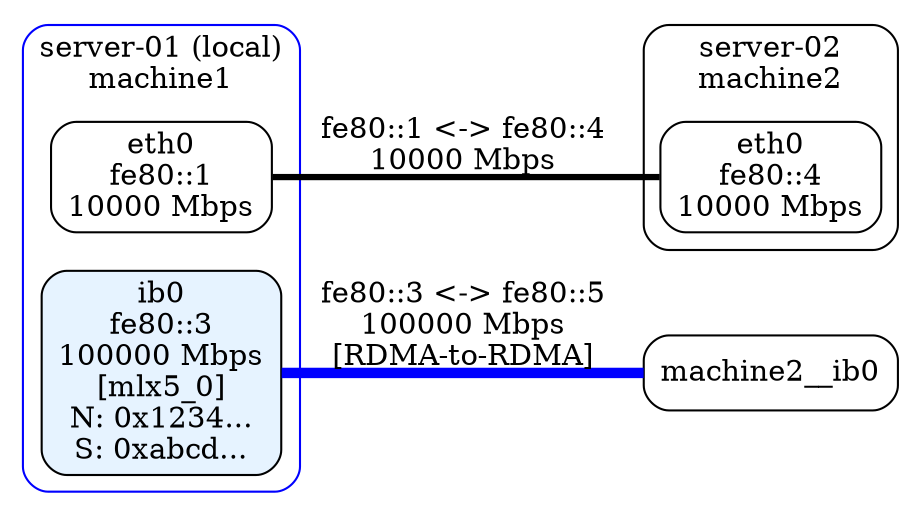
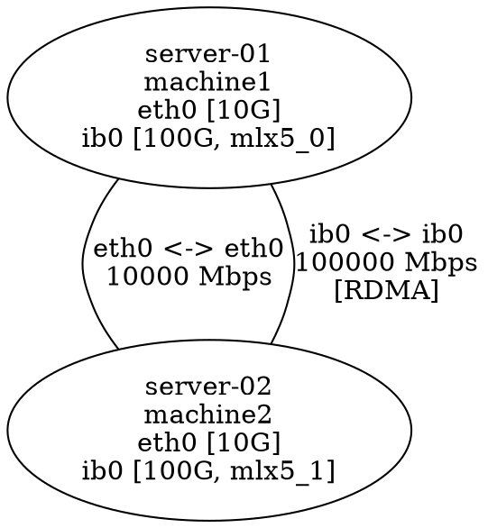
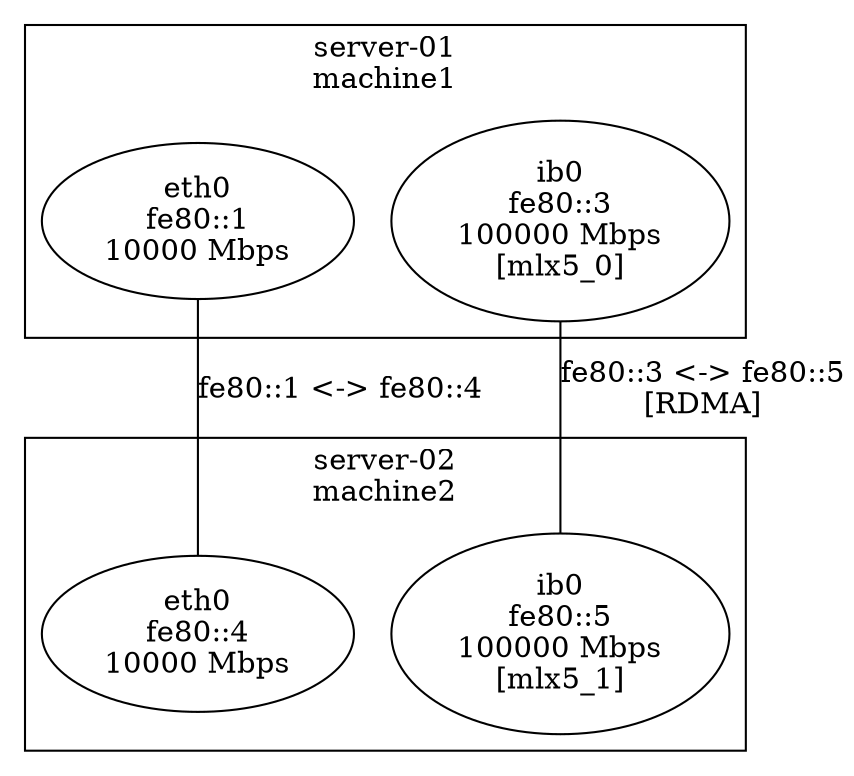

# Subgraph Visualization

## Overview

Starting with version 0.3.0, lldiscovery uses **subgraph-based visualization** for improved scalability and clarity in large network topologies. Each machine is rendered as a cluster (subgraph) containing separate nodes for each network interface.

## Benefits

### Scalability
- **Large Topologies**: Remains readable with 100+ hosts
- **Interface Clarity**: Easy to trace connections between specific interfaces
- **Reduced Visual Clutter**: Interface information grouped within machine clusters
- **Better Layout**: Graphviz can optimize cluster positioning for clearer graphs

### Multi-Interface Support
- **Multiple Connections**: Machines with multiple interfaces show all paths clearly
- **Interface Grouping**: Related interfaces visually grouped within their host
- **Connection Tracing**: Easy to see which interface connects where
- **RDMA Visibility**: RDMA interfaces highlighted within their host context

### Network Understanding
- **Segmentation**: VLANs and network segments visible through interface grouping
- **Redundancy**: Bonded or redundant connections clearly shown
- **Path Analysis**: Multiple paths between hosts easier to identify
- **Capacity Planning**: Link speeds and interface types visible at a glance

## Structure

### Machine Clusters
Each machine is represented as a **subgraph cluster** with:
- **Border label**: Hostname and short machine ID (first 8 characters)
- **Border color**:
  - **Blue**: Local node (where daemon is running)
  - **Black**: Remote nodes
- **Rounded rectangle** border style

### Interface Nodes
Each network interface is a **separate node** inside its machine cluster showing:
- **Interface name** (e.g., `eth0`, `ib0`, `ens3f0`)
- **IPv6 link-local address** (e.g., `fe80::1`)
- **Link speed** in Mbps (e.g., `10000 Mbps` for 10 Gbps)
- **RDMA information** (if applicable):
  - RDMA device name in brackets (e.g., `[mlx5_0]`)
  - Node GUID (e.g., `N: 0x1234:5678:90ab:cdef`)
  - System Image GUID (e.g., `S: 0xfedc:ba09:8765:4321`)

**Styling**:
- Regular interfaces: Rounded box
- RDMA interfaces: Rounded box with light blue fill (`#e6f3ff`)

### Edge Connections
Edges connect **interface nodes** (not machine nodes) with:
- **Labels showing**:
  - IPv6 addresses on both ends
  - Link speeds (if available)
  - `[RDMA-to-RDMA]` indicator for InfiniBand/RoCE connections
- **Line thickness**: Based on link speed (thicker = faster)
- **Line color**:
  - **Blue**: RDMA-to-RDMA connections
  - **Black**: Regular Ethernet connections
- **Line style**:
  - **Solid**: Direct connections (observed locally)
  - **Dashed**: Indirect connections (learned from neighbors)

### Network Segments
When segment detection is enabled (`-show-segments`):
- **Yellow ellipse nodes** represent shared network segments
- **Label shows**:
  - Segment interface name
  - Number of connected nodes
  - `[RDMA]` indicator if all connections are RDMA
- **Connections**: Dotted lines from segment to interface nodes
- **Smart edge hiding**: Individual edges hidden when segment representation exists

## Example Visualization

### Simple Topology (3 hosts)
```
┌─────────────────────────────────┐
│ server-01 (local) [12345678]    │ ← Blue border (local)
│ ┌─────────┐ ┌─────────┐        │
│ │ eth0    │ │ ib0     │        │ ← Interface nodes
│ │ fe80::1 │ │ fe80::3 │        │
│ │ 10G     │ │ 100G    │        │
│ └────┬────┘ └────┬────┘        │
└──────┼──────────┼──────────────┘
       │          │ 
       │          │ Blue thick line (RDMA)
       │          ↓
       │    ┌──────────────────────┐
       │    │ server-02 [23456789] │ ← Black border (remote)
       │    │ ┌─────────┐         │
       │    │ │ ib0     │         │ ← Light blue fill (RDMA)
       │    │ │ fe80::5 │         │
       │    │ │ 100G    │         │
       │    │ │ [mlx5_1]│         │
       │    │ └─────────┘         │
       │    └──────────────────────┘
       │
       ↓ Black normal line (Ethernet)
  ┌──────────────────────┐
  │ server-03 [34567890] │
  │ ┌─────────┐         │
  │ │ eth0    │         │
  │ │ fe80::6 │         │
  │ │ 10G     │         │
  │ └─────────┘         │
  └──────────────────────┘
```

### With Network Segment (5 hosts on shared switch)
```
        ┌─────────────────┐
        │  segment: eth0  │ ← Yellow ellipse
        │    5 nodes      │
        └────────┬────────┘
                 │ Dotted lines to all connected interfaces
      ┌──────────┼──────────┬──────────┬──────────┐
      │          │          │          │          │
      ↓          ↓          ↓          ↓          ↓
  ┌────────┐ ┌────────┐ ┌────────┐ ┌────────┐ ┌────────┐
  │ srv-01 │ │ srv-02 │ │ srv-03 │ │ srv-04 │ │ srv-05 │
  │┌──────┐│ │┌──────┐│ │┌──────┐│ │┌──────┐│ │┌──────┐│
  ││eth0  ││ ││eth0  ││ ││eth0  ││ ││eth0  ││ ││eth0  ││
  │└──────┘│ │└──────┘│ │└──────┘│ │└──────┘│ │└──────┘│
  └────────┘ └────────┘ └────────┘ └────────┘ └────────┘
```

## DOT Format Structure

### Basic Format


### Node ID Format
- **Interface nodes**: `{machineID}__{interfaceName}`
  - Example: `machine1__eth0`, `machine2__ib0`
- **Machine clusters**: `cluster_{machineID}`
  - Example: `cluster_machine1`
- **Segment nodes**: `segment_{index}`
  - Example: `segment_0`, `segment_1`

## Graphviz Rendering

### Recommended Commands
```bash
# PNG output (good for viewing)
dot -Tpng topology.dot -o topology.png

# SVG output (best for large topologies, scalable)
dot -Tsvg topology.dot -o topology.svg

# PDF output (good for documentation)
dot -Tpdf topology.dot -o topology.pdf

# Specify layout engine for large graphs
neato -Tpng topology.dot -o topology.png     # Force-directed layout
fdp -Tpng topology.dot -o topology.png       # Force-directed with springs
circo -Tpng topology.dot -o topology.png     # Circular layout
```

### Layout Tips for Large Topologies
1. **Use SVG format**: Scalable and can be zoomed without quality loss
2. **Try different engines**: `neato` or `fdp` may work better than `dot` for large graphs
3. **Increase DPI**: Add `-Gdpi=150` for higher resolution
4. **Adjust spacing**: Add `-Gnodesep=1.0 -Granksep=2.0` for more space
5. **Horizontal layout**: Use `rankdir=TB` for top-to-bottom instead of left-to-right

### Example with Options
```bash
# High-quality SVG with extra spacing
dot -Tsvg -Gdpi=150 -Gnodesep=1.0 -Granksep=2.0 topology.dot -o topology.svg

# Large graph with force-directed layout
fdp -Tpng -Gdpi=200 -Gsplines=true topology.dot -o topology.png
```

## Comparison: Before vs After

### Before (Flat Structure)

**Issues**:
- Interface details crammed into single node label
- Multiple edges between same two nodes (confusing)
- Hard to trace specific interface connections
- Doesn't scale well with many interfaces

### After (Subgraph Structure)

**Benefits**:
- Clear interface grouping within machines
- Edges directly connect interface nodes
- Easy to trace connections
- Scales to 100+ hosts with many interfaces

## Integration with Network Segments

When network segment detection is enabled, the subgraph structure works seamlessly:
1. **Segment nodes** connect to interface nodes (not machine nodes)
2. **Individual edges** from local machine to segment members are hidden
3. **Non-segment edges** remain visible (different interfaces, external connections)
4. **Segment label** shows which interface the segment represents

This allows you to see both high-level connectivity (through segments) and low-level details (specific interfaces) in the same visualization.

## Future Enhancements

Possible improvements for future versions:
- **Interface status indicators**: Show up/down state with colors
- **Traffic statistics**: Display bandwidth usage if monitoring is added
- **Physical location clustering**: Group machines by rack/datacenter
- **Port channels/LAG**: Show bonded interfaces as nested clusters
- **Virtual interfaces**: Distinguish VLAN interfaces, bridges, bonds visually

## See Also

- `NETWORK_SEGMENTS.md` - Network segment detection algorithm and visualization
- `README.md` - General usage and configuration
- `RDMA_EDGE_VISUAL.md` - RDMA connection visualization details
